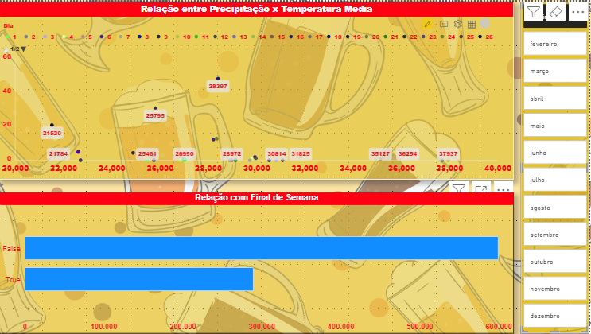

<h1 align="center">
  
</h1>

# CASE CERVEJARIA POR CRISTIANE RODRIGUES

### Sobre o Projeto

Este é um projeto fictício que consiste na criação de um relatório em dashboard sobre o consumo de cerveja e a relação entre ela e as chuvas, durante o período de um ano..

### Problema

### Solução

 Nesta solução encontrei no grafico de scatter a relação perfeita para visualizar como a Temperatura Média e a Precipitação da Chuva se comporta, e também coloquei uma relação do final de semana. Todos os graficos são filtrados por meses. Lembrando que o dataset tem 365 rows que consistem, especificamente, em todos os dias de um ano. 

---

 Nesta solução exibo o total de consumo por dia.Também coloquei uma relação do final de semana. Todos os graficos são filtrados por meses. Lembrando que o dataset tem 365 rows que consistem, especificamente, em todos os dias de um ano. 

---

 Nesta solução, contemplo as tres categorias de temperatura, como um indicador. Temp Max, Temp Media e Temp Min. Além disso, exibo um grafico de linha para mostrar a tendência do consumo de cerveja por dia, relacionando-os com os meses do ano. Mostrando como ao longo do tempo, o grafico muda. 
